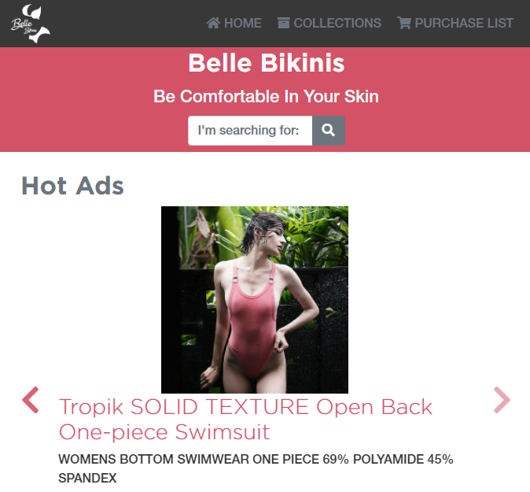

# Project Name: Bella Bikinis Online Shop

This is an online shop for Bella Bikinis, a brand for beach bikinis & dresses, which you can get directly from your home.

## Description

The main page features a header with a navigation bar, a slider for the most popular items and three different sections for bikinis of 2 and 1 pieces, and beach dresses. 

It is based on HTML, CSS, SASS and Bootstrap.

## Built With

- Major languages: HTML & CSS.
- Preprocessors: SASS.
- Frameworks: Bootstrap.

## Screenshots

- Mobile view


## Live Demo

[Belle Bikinis website](https://carlos-osorio-developer.github.io/mv-week4-htmlcapstone/)

# Getting Started 🚀

These instructions will get you a copy of the project up and running on your local machine.

## How To Use 🔧

From your command line, first clone the project:

```bash
# Clone this repository
$ git clone https://github.com/carlos-osorio-developer/Education-FundaReserva

# Go into the repository
$ cd Education-FundaReserva

# Open the project on Vscode
$ code .

```

## Authors

👤 **Carlos Osorio**

- GitHub: [@carlos-osorio-developer](https://github.com/carlos-osorio-developer)
- Twitter: [@OsorioDevelops](hhttps://twitter.com/@OsorioDevelops)
- LinkedIn: [Carlos Osorio](https://www.linkedin.com/in/carlos-osorio-developer/)

## 🤝 Contributing

Contributions, issues, and feature requests are welcome!

Feel free to check the [issues page](./issues/).

## Show your support

Give a ⭐️ if you like this project!

## Acknowledgments

- The design of this page was made by [Mohammed Awad](https://www.behance.net/M_Awad) and you can find it on [Behance](https://www.behance.net/gallery/24796463/ZATTIX)

## 📝 License

This project is [MIT](lic.url) licensed.